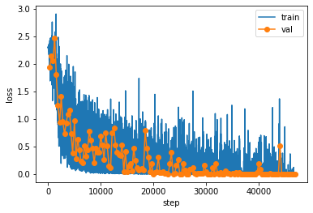

# pytorch EuroSat vgg19

This repo contains a pytorch implementation of a VGG19 trained on the Sentinel-2 classification dataset [EuroSat]( https://github.com/phelber/EuroSAT)

Performing classification on this dataset is in now way shape or form a hard task. This was just done to produce a set of VGG19 weights, susceptible for a **four channel input** and kernels that are trained to **detect features in satellite imagery**. 

Those weights can be used to serve as a ***perceptual loss*** for other remote sensing machine learning tasks, or a pretrained network for fine tuning if you don't have a GPU.

Here a peak view on how training process usually (with default parameter) looks over 50 epochs:

